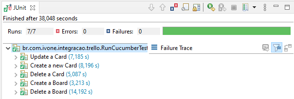

## Trello + Sensedia = _Ivone Feliz!!! Muito Obrigada pela oportunidade!_

### 1.0 Instalação 

#### 1.1 Ferramentas:
Tecnologias necessárias/usadas:
**_Java 11 - Cucumber, JUnit, Maven, PicoContainer, Postman, Project Lombok, REST Assured._**

#### 1.2 Postman:
Usado para testes de integração e documentação.
Sua estrutura acompanha a documentação da API do Trello.

#### 1.3 Project Lombok:
Para instalação do plugin do Project Lombok na usa IDE preferida utilize o link: https://projectlombok.org/.
Na opção "Install" você pode encontrar todas as IDEs suportadas.

#### 1.4 Configuração
Para configurar um usuário preencha a "key" e o "token" no arquivo "application.properties".

### 2.0 Arquitetura

#### 2.1 Organização do REST Assured:
Para se adequar as features do Cucumber, foi realizado a seguinte organização:

_Foi separado Rest Assured **DE**:_

```java
given()
   .queryParam("key", propriedade("trello.key"))
   .queryParam("token", propriedade("trello.token"))
   .queryParam("name", "Sensedia2")
   .contentType(ContentType.JSON)
.when()
   .post(propriedade("trello.url") + "1/boards/")
.then()
   .statusCode(HttpStatus.SC_OK)
   .contentType(ContentType.JSON);
```

_**PARA** uma estrutura separada em médotos:_

```java
@Given("um token {string}")
public void um_token(String token) {
    dado.queryParam("token", getValorOuPropriedade(token, "trello.token"));
}
```
#### JUnit

 
    
#### Apêndice
* _Documentação da API do Trello - https://developer.atlassian.com/cloud/trello/rest/api-group-actions/_
